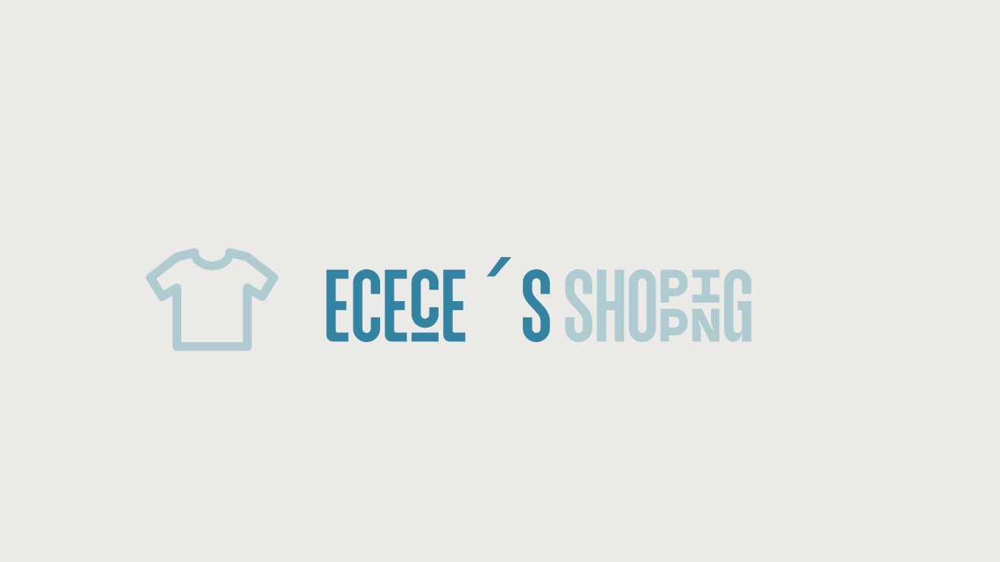

# Ecece´s Shopping 

## Descripción del negocio online 
Aquí encontrarás una tienda de ropa, en la que verás productos de los mas comunes 
a los más exclusivos. Este proyecto busca proporcionar una experiencia de compra 
única y especial.

**No te lo pienses y entra a ver la tienda.**

## Carácterísticas que puedes encontrar en la tienda
- Catálogo diverso de productos de moda.
- Navegación fácil e intuitiva para el usuario.
- Detalles de productos con imágenes y precios.
- Sección de contacto para consultas y soporte al cliente.
- Redes Sociales

## Técnologias usadas en la página web

- HTML5
- CSS

## Instalación 
Si quieres ver a detalle como esta creado puedes 
instalar el repositorio siguiendo estos pasos:

1. Clona el repositorio: "git clone https://github.com/Jferrui0803/jferrui0803.github.io.git"

2. Abre el archivo Index.html en el navegador web.

*En el caso de que no quieras instalarlo puedes buscarlo escribiendo en tu navegador:* **https://jferrui0803.github.io/**

## Uso
Explora las diferentes secciones de la tienda en línea, y mira nuestras redes sociales para futuras noticias.

## Contribución
Si quieres contribuir en este proyecto, sigue estos pasos:

1. Haz un fork del repositorio.
2. Crea una rama para tu contribución: "git checkout -b feature/nueva-funcionalidad"
3. "Realiza tus cambios y haz commit: "git commit -m 'Agrega nueva funcionalidad'"
4. Haz push a tu rama: "git push origin feature/nueva-funcionalidad".

## Soporte del proyecto
Para obtener asistencia o informar problemas,  por favor, utiliza la sección de "Issues" en este repositorio.

## Licencia 
Este proyecto está bajo la Licencia MIT.

## Agradecimientos 
Muchas gracias por leer, espero que os guste el proyecto.